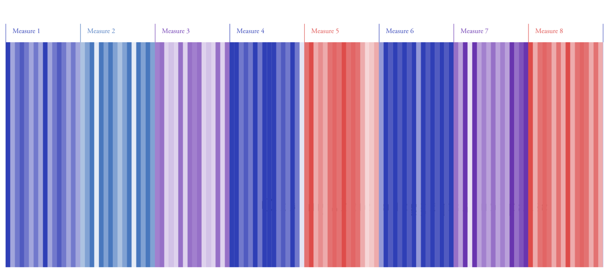
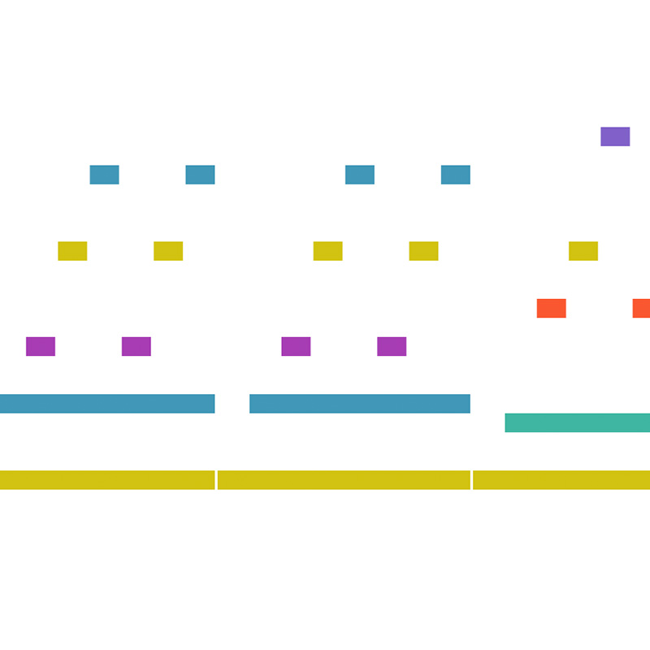
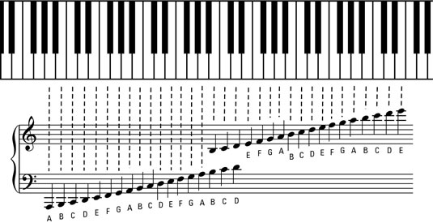
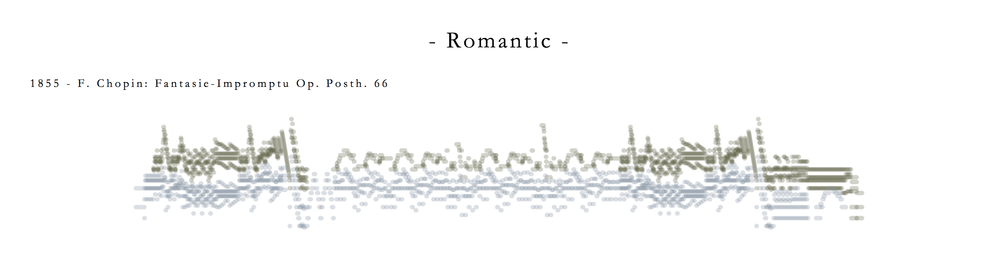

# Computational Form Case Study Assignment

When I first began this project I was trying to think of ways in which computation form related to data visualization, and I was met with confusion. I was sure that taking this class had influenced my data visualization practice, but it seemed to have done that in rather subtle ways: I don’t feel that I ever explicitly use—at least consciously—a particular tactic like any of the themes from each of the weeks. Instead, I feel that this class has taught me about how to use code to generate playful experiences, which is an essence I try an incorporate into visualizations. Other than that, I did not have much experience coding before this class—and even less before this year—, so this class has also helped me realize the attraction in creating work procedurally and having the computer “do work” that I would otherwise have to do manually. It is this latter takeaway that I focused on for this case study assignment. 

In an Information Aesthetics class last semester, I made a visualization of a Bach prelude that attempted to visualize harmonic musical patterns through colors. It looked like this: 

 

and it can be seen [here](https://rikghosh.github.io/information-aesthetics/5.final-project/). 

To make this visualization, I used a program called midi-csv [3] to convert a midi file of the piece to a text document that contained numerical information about each note. Then, I manually went through the file and edited it, fixing errors and adjusting its structure to fit the code I had written to visualize it. In the end, the visualization received positive feedback, but I was also told that it would be even more interesting to see this sort of representation for a variety of pieces to truly get an understanding of the visualization system I had created. Because the visualization took so much manual work to create, however, repeating it for multiple other pieces was not really feasible. Furthermore, the piece I had chosen had only one voice, and a constant stream of notes of equal length. The system I had built took advantage of that, and it would not have worked for pieces with multiple voices or with any sort of rhythmic change—most pieces, basically. 

Since this was something I’m already interested in, this case study assignment seemed like an opportunity to create a similar visualization procedurally that compares many pieces, and this is what I did. To avoid the manual processing of the file, I found a script that someone had written to make the MIDICSV output a bit more friendly [2]. This script did not immediately work—it was written in python and, due to version changes, required quite a bit of editing. I think this class has made me far more comfortable with approaching new packages and programming languages, so it was not too much a of a struggle to figure out what the python code was saying and to use tactics I had developed though the semester to find out what changes I needed to make to it. In any case, I think it is something that would have frustrated me last semester. I used this fixed script to process MIDI files I found from a comprehensive sheet music sharing website called MuseScore [1]. I then wrote a p5 script that parsed these csv files and mapped the data to visuals that incorporated multiple voices and rhythms in addition to pitch. I abandoned the concept of representation of harmony through color since I wanted to do everything completely procedurally and it would be a very large project to fully abstract music theory—perhaps that is the next step!

My resulting visualization for each piece was in essence a piano roll representation:

which, in a way, is similar to staff notation:

Both map pitch to vertical position and time/rhythm, roughly, to a horizontal position. In the case of staff notation, there is wrapping to fit the staves on a page. I thought it would be interesting to take this idea and compress it, so that individual notes are less important and overall shapes and patterns become more important—essentially, I created an aggregate shape for an entire piece, which illuminates larger patterns within the piece as well as how the piece compares to other pieces. The result looked like this:

Because everything was done procedurally, this time I was able to easily create this sort of shape for many pieces—I did fifteen—, and to add an additional comparative element, I decided to do three pieces from each of five musical periods. I chose pieces that I had played before so that I would know intimately how they sounded and if the resulting shape was a good representation. In addition, I did my best to give a good cross section of each period as a whole since they are not entirely homogenous. 

This project was very much more accessible with the skills I have developed this semester. The most notable technique I used, I think, is the facility with creating work both procedurally and manually. Before I hadn’t really thought of creating work with code in p5 and then editing or using it elsewhere. Here, I generated the shape for each piece in p5, saved them all as images, and then incorporated them into a regular html webpage, which I used to frame the work and provide narrative and historical motivation. 

The resulting product can be seen [here](rikghosh.github.io/compform/grad).

## References
[1] “Create, Play and Print Beautiful Sheet Music.” Free Music Composition and Notation Software | MuseScore, musescore.org/en.

[2] Jonas, Peter. “Shoogle/Midicsv-Process.” GitHub, 2017, github.com/shoogle/midicsv-process.

[3] Walker, John. “MIDICSV: Convert MIDI File to and from CSV.” MIDICSV, Www.fourmilab.ch, www.fourmilab.ch/webtools/midicsv/.
